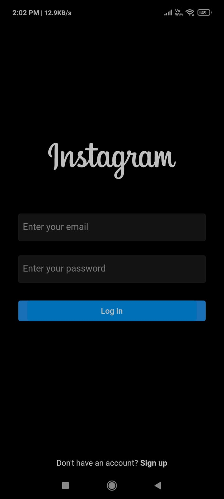
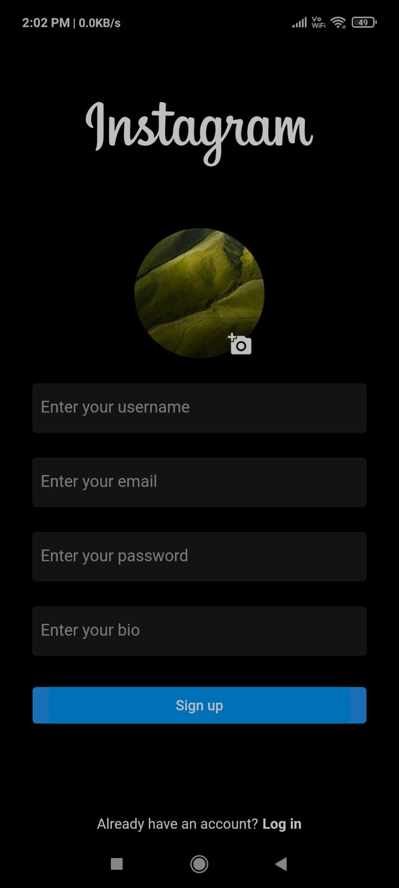
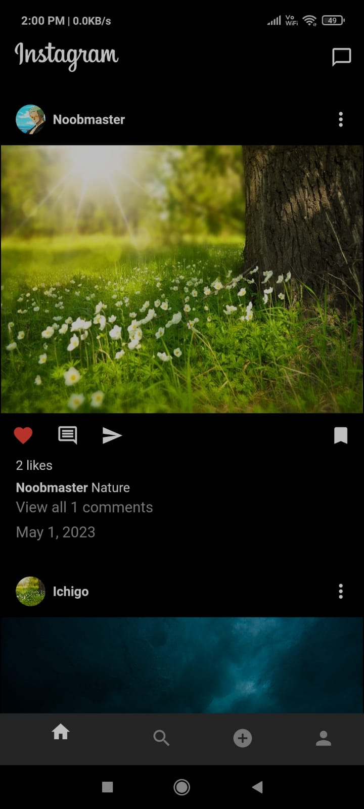
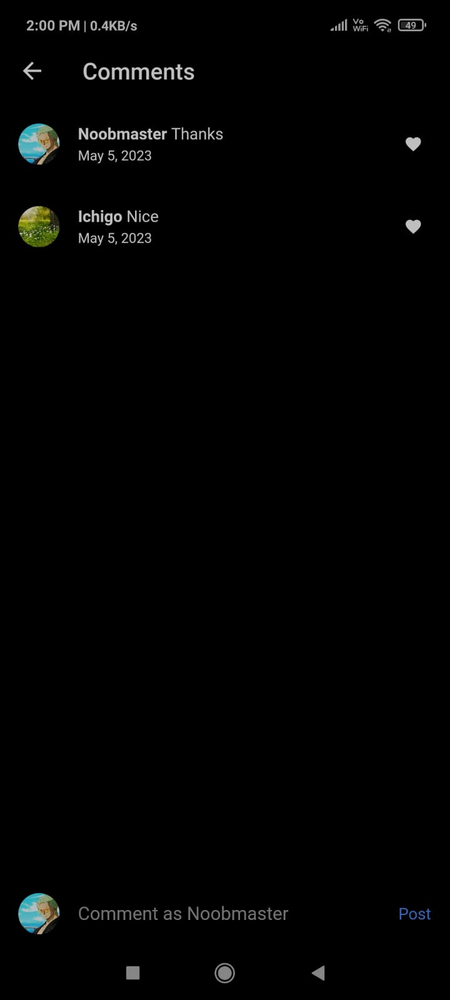
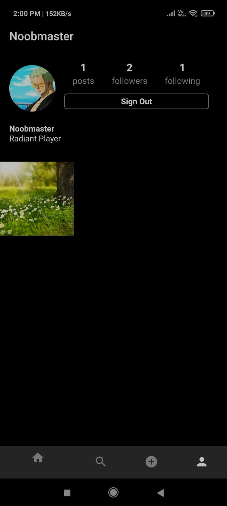

# Instagram Clone

- A Flutter Instagram App Clone for both web and mobile.
- Users can add posts as well as like and comment on posts of other users.
- Users can follow each other and search for other users.
- The app uses Cloud Firestore and Firebase Authentication.

# Screenshots

   
  
   

## Getting Started

This project is a starting point for a Flutter application.

A few resources to get you started if this is your first Flutter project:

- [Lab: Write your first Flutter app](https://docs.flutter.dev/get-started/codelab)
- [Cookbook: Useful Flutter samples](https://docs.flutter.dev/cookbook)

For help getting started with Flutter development, view the
[online documentation](https://docs.flutter.dev/), which offers tutorials,
samples, guidance on mobile development, and a full API reference.
